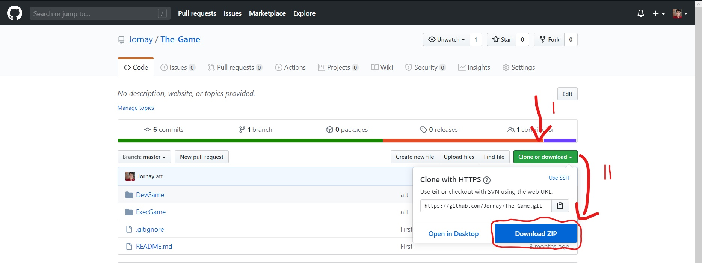

<h1 align="center">
    
</h1>
<h1>
    
</h1>

# Indice
- [Sobre](#-sobre)
- [Tecnologias utilizadas](#-tecnologias-utilizadas)
- [Como baixar o projeto](#-como-baixar-o-projeto)


## 📋**Sobre**

O projeto **The Journey** é um jogo desenvolvido durante a minha graduação, de maneira mais precisa, esse Jogo seria o projeto de conclusão da disciplina.

---

## 🔬Tecnologias utilizadas 

O projeto foi desenvolvido utilizando as seguintes tecnologias:

- [Unity](https://unity.com/pt)
- [3ds-Max](https://www.autodesk.com.br/products/3ds-max/overview?plc=3DSMAX&term=1-YEAR&support=ADVANCED&quantity=1)
- [C#](https://unity.com/pt/how-to/beginner-game-coding-resources)
---
## 💾Como baixar o projeto

Clonando o repositório a partir do git-bash:
 ```bash
    #Clonando repositório
    $ git clone https://github.com/Jornay/The-Journay
 ```

Clonando o repositório a partir do GitHub na web:

- Entre nesse link: https://github.com/Jornay/The-Journay
- Após isso Click aqui: 


---

### Desenvolvido por:
- [Lucas de Abreu](https://github.com/Jornay) 
- [Luis Otavio](https://github.com/Luisotee)
- [Gustavo Galo](https://github.com/GustavoGalo)

